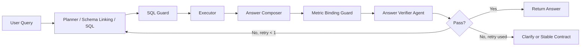
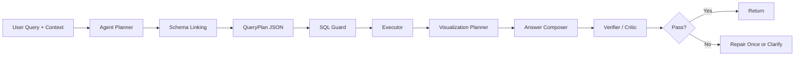

# 技术实现方案 v1.0

## 1. 技术目标

ChargeBI v1.0 需要实现一个可运行、可部署、可体验的智能问数 Web Demo。

技术目标：

- 支持开放式自然语言问数
- 支持多轮上下文
- 支持地图、图表、表格和可信解释
- 支持 Kimi 或 DeepSeek API
- 使用本地文件数据库，降低部署复杂度
- 保证 SQL 查询只读、安全、可控
- 与个人网站后续集成成本低

## 2. 推荐技术栈

### 2.1 前后端

建议优先使用 Next.js。

理由：

- 适合做独立 Web App
- 可同时承载前端页面和 API
- 部署路径清晰
- 生态成熟，适合快速 vibecoding
- 后续可以从个人网站跳转或嵌入

建议版本：

- Next.js App Router
- TypeScript
- React

### 2.2 UI 与样式

建议：

- Tailwind CSS
- shadcn/ui 或轻量自定义组件
- lucide-react 图标

原因：

- 易于做浅色 SaaS 风格
- 组件开发快
- 能贴合个人网站暖橙、卡片式视觉

### 2.3 图表

建议使用 Recharts。

原因：

- React 集成简单
- 足够支持折线图、柱状图、环形图、热力图近似展示
- 作品集 Demo 不需要复杂 BI 图表引擎

### 2.4 地图

第一版建议使用 Leaflet。

原因：

- 免费、轻量
- 上手快
- 支持点位、聚合、弹窗和基础交互
- 不强依赖国内地图服务密钥

备选：

- 高德地图 Web JS API：国内地图底图更熟悉，但需要申请 Key。
- Mapbox：视觉强，但配置和配额复杂。

第一版策略：

- 如果 Leaflet 底图访问不稳定，可改为自绘简化上海区域地图或使用静态底图 + 点位覆盖。

### 2.5 数据库

建议第一版使用 SQLite。

理由：

- 单文件部署
- 查询能力足够
- Node.js 生态成熟
- 便于生成和迁移样例数据

备选：

- DuckDB：分析查询能力更强，但 Web 部署和 Node 集成可能增加复杂度。

当前建议：

- 默认 SQLite
- 若后续聚合性能不足，再评估 DuckDB

### 2.6 大模型

候选：

- DeepSeek
- Kimi

建议：

- 第一版优先 DeepSeek，保留 Kimi 适配层。

理由：

- DeepSeek API 生态和 OpenAI 风格接口较常见
- 成本和开发体验较适合 Demo
- Kimi 可作为后续模型切换选项

注意：

- 模型 Key 不写入仓库
- 使用环境变量配置

当前实现：

- 已支持通过 `DEEPSEEK_API_KEY` 调用 DeepSeek。
- 初版调用 DeepSeek 做意图识别和问题归一化，再进入规则兜底 SQL 链路。
- 如果模型调用失败、超时或返回不可解析内容，系统自动回退到规则链路。
- 当前不需要多模态能力，文本对话 API 即可。

## 3. 系统架构

推荐架构：

```text
User Browser
  |
  | Natural Language Question
  v
Next.js Frontend
  |
  | POST /api/query
  v
Query Orchestrator
  |
  +-- Context Manager
  +-- Intent Parser
  +-- Schema Linker
  +-- SQL Generator
  +-- Query Guard
  +-- SQLite Executor
  +-- Chart Spec Builder
  +-- Answer Summarizer
  |
  v
Structured Response
  |
  v
Frontend Renderer
  |
  +-- AI Message
  +-- KPI Cards
  +-- Chart
  +-- Result Table
  +-- Map Highlight
  +-- Trust Panel
```

## 4. 目录结构建议

```text
chargebi/
  app/
    page.tsx
    api/
      query/
        route.ts
  components/
    chat/
    charts/
    map/
    metrics/
    trust-panel/
    layout/
  lib/
    ai/
      model-client.ts
      prompts.ts
      schema-linker.ts
      sql-generator.ts
      summarizer.ts
    data/
      db.ts
      schema.ts
      metrics.ts
      seed.ts
    query/
      orchestrator.ts
      guard.ts
      context.ts
      chart-spec.ts
      errors.ts
  data/
    chargebi.sqlite
  scripts/
    generate-data.ts
  docs/
```

如果仓库根目录直接作为项目目录，也可以不再嵌套 `chargebi/`。

## 5. AI 问数链路

### 5.0 架构策略修正

当前初版为了保证作品集 Demo 稳定，使用了“DeepSeek 意图识别 + 规则兜底 SQL”的实现方式。

这个方式适合：

- 推荐问题稳定演示
- 已知问题类型兜底
- SQL 安全护栏验证
- 产品链路原型展示

但它不适合作为真正智能问数的核心能力。

真正的智能问数主链路应升级为：

```text
用户自然语言问题
  -> 上下文补全
  -> 权限与隐私判断
  -> LLM 语义解析
  -> 指标词典匹配
  -> Schema Linking
  -> 数据可得性检查
  -> 查询计划生成
  -> SQL 生成
  -> SQL 安全校验
  -> SQL 执行
  -> 结果校验与反思
  -> 业务结论和图表生成
```

规则逻辑后续只承担：

- 推荐问题模板
- 低置信度兜底
- SQL 安全限制
- 常见错误修复
- Demo 离线模式

当前目标架构更新：

```text
用户问题
  -> DeepSeek QueryPlan
      - 权限判断
      - 数据可得性判断
      - 指标词典匹配
      - Schema Linking
      - 多意图 sub_queries 编排
      - SQL 生成
  -> Query Guard
  -> SQLite 执行
  -> DeepSeek 结果解释
  -> 结果后处理和可视化编排
  -> 前端展示图表、表格、地图联动和可信解释
  -> 失败时规则兜底
```

AI-first 链路要求：

- 模型必须输出结构化 JSON，不直接把自然语言回答作为查询依据。
- 每个 sub_query 都要包含命中的表、字段、SQL、指标口径和可视化建议。
- 后端必须校验 SQL，只允许只读查询。
- 如果模型判断缺少数据，系统应直接解释缺少哪些数据，不生成 SQL。
- 结果解释必须基于 SQL 返回结果，不允许编造。

### 5.0.3 结果后处理与可视化编排

查询结果不能直接“原样丢给图表”。系统需要根据用户问题做结果后处理：

- 如果问题是最高 vs 最低、A vs B、区域对比，需要生成差值行或差异指标。
- 如果用户问“差多少”，表格必须增加“差值”行。
- 如果用户问“倍数/相差几倍”，表格应增加倍数或比例。
- 图表应围绕用户真正关心的比较关系，而不是机械画第一列指标。

可视化编排规则：

| 查询类型 | 表格处理 | 图表 |
|---|---|---|
| 最高 vs 最低 | 增加差值行 | 多指标对比柱状图 |
| 多意图极值 | 每个子问题一行 | 子问题结果对比图 |
| 趋势 | 保持时间序列 | 折线图 |
| 排名 | 保持 TopN | 横向柱状图 |
| 差异比较 | 增加差值/倍数 | 对比卡 + 分组柱状图 |

### 5.0.1 权限与数据可得性原则

智能问数必须遵守：

1. 先判断能不能查，再判断怎么查。
2. 涉及手机号、车牌、个人身份、明细导出等敏感数据时，不进入 SQL 生成。
3. 如果数据库没有用户所问指标，不能编造字段或结论。
4. 如果现有字段可以计算目标指标，需要明确展示计算口径。
5. 如果现有字段无法计算，需要如实说明缺少哪些数据。

示例：

| 用户问题 | 处理方式 |
|---|---|
| 查询某用户手机号 | 拒绝，涉及敏感个人信息 |
| 哪个站客户满意度最低 | 告知当前数据库没有评价、投诉或满意度字段 |
| 哪个站净利率最低 | 可计算，但需说明是示例口径 |
| 哪个站真实利润最低 | 当前没有真实成本、租金、电力采购结算数据，无法计算真实利润 |

Data Availability Check 输出建议：

```json
{
  "can_query": false,
  "reason": "missing_data",
  "missing_fields": ["customer_rating", "complaint_count"],
  "can_derive": false,
  "suggested_questions": [
    "哪些站点故障率最高？",
    "哪些站点利用率最低？"
  ]
}
```

### 5.0.2 多意图拆解原则

当用户 query 包含多个独立问题时，查询计划不能压缩成一个单指标查询。

示例：

用户问题：

> 过去一周哪个站点的亏损额最高？哪个站点的营业额最高？哪个站点的净利率最高？

应拆解为：

```json
{
  "sub_queries": [
    {
      "name": "亏损额最高站点",
      "metric": "loss_amount",
      "sort": "desc",
      "limit": 1
    },
    {
      "name": "营业额最高站点",
      "metric": "revenue",
      "sort": "desc",
      "limit": 1
    },
    {
      "name": "净利率最高站点",
      "metric": "net_margin",
      "sort": "desc",
      "limit": 1
    }
  ]
}
```

回答时需要：

- 分别说明每个子问题的结果。
- 不把“最高”和“最低”的排序方向混淆。
- 如果多个子问题命中同一站点，可以说明重合原因。
- 地图高亮所有命中的站点。

复杂编排问题需要支持：

- 多意图拆解：一个 query 拆成多个 `sub_queries`。
- 比较问题：不同区域、站点、时间段或指标之间做并列对比。
- 计算问题：基于指标词典和可用字段计算派生指标，例如示例亏损额、示例净利率。
- 排序方向识别：最高、最低、最严重、最多、最少、下降最大等必须映射到明确排序方向。
- 结果合成：多个子查询分别执行后，再生成一个综合结论。

技术方案建议：

```text
LLM Query Planner
  -> 输出 QueryPlan
  -> QueryPlan 包含 sub_queries[]
  -> 每个 sub_query 独立做 Data Availability Check
  -> 每个 sub_query 独立生成 SQL
  -> Guard 校验每条 SQL
  -> 并行或串行执行 SQL
  -> 合成 Answer Blocks
  -> 地图高亮所有命中实体
```

QueryPlan 示例：

```json
{
  "query_type": "multi_intent",
  "time_range": "last_7_days",
  "entity": "station",
  "sub_queries": [
    {"name": "亏损最严重", "metric": "loss_amount", "sort": "desc", "limit": 1},
    {"name": "盈利最多", "metric": "profit_amount", "sort": "desc", "limit": 1},
    {"name": "利用率最低", "metric": "utilization_rate", "sort": "asc", "limit": 1}
  ]
}
```

### 5.1 输入

用户输入：

- 自然语言问题
- 当前对话上下文
- 当前地图选区
- 当前时间范围

示例：

```json
{
  "question": "这些站点收入损失多少？",
  "context": {
    "timeRange": "last_week",
    "selectedStations": ["ST_PD_001", "ST_XH_003"],
    "lastIntent": "fault_ranking"
  }
}
```

### 5.2 意图识别

识别字段：

- intent：趋势、排名、对比、异常、归因、预测、建议、超范围、隐私
- metrics：订单量、收入、利用率、故障率等
- dimensions：区域、站点、时间、站点类型等
- filters：时间、区域、站点、状态等
- needsClarification：是否需要澄清

### 5.3 Schema 匹配

输入：

- 用户问题
- 意图识别结果
- 数据库 Schema
- 指标词典

输出：

- 命中表
- 命中字段
- 匹配理由
- 置信度

### 5.4 SQL 生成

SQL 生成需遵守：

- 只生成 SELECT
- 使用白名单表
- 使用明确字段
- 默认 LIMIT
- 聚合查询需有清晰 GROUP BY
- 时间过滤尽量使用 `dim_calendar` 或日期字段

### 5.5 SQL 校验

Query Guard 必须检查：

- 是否只读
- 是否包含禁用关键字
- 是否访问白名单表
- 是否访问敏感字段
- 是否包含 LIMIT
- 是否可能返回过多明细
- 是否符合当前权限策略

禁用关键字：

- DELETE
- UPDATE
- INSERT
- DROP
- ALTER
- CREATE
- TRUNCATE
- PRAGMA 写操作

### 5.6 查询执行

执行策略：

- 使用只读连接或只读逻辑限制
- 查询超时时间建议 5 到 10 秒
- 返回结构化 rows 和 columns
- 空结果进入友好空状态

### 5.7 总结与图表

模型或规则生成：

- answerSummary
- kpiCards
- chartSpec
- resultTable
- mapHighlight
- followUpQuestions
- trustPanel

## 6. API 设计

### POST /api/query

请求：

```json
{
  "question": "最近30天各区域充电收入排名如何？",
  "conversationId": "demo-session",
  "context": {
    "selectedRegion": null,
    "selectedStation": null,
    "timeRange": null
  }
}
```

响应：

```json
{
  "understanding": {
    "intent": "ranking",
    "interpretedQuestion": "查询最近30天上海各区域充电收入，并按收入排序",
    "timeRange": "最近30天",
    "metrics": ["充电收入"],
    "dimensions": ["区域"],
    "filters": []
  },
  "workflow": [
    {"step": "理解问题", "status": "completed"},
    {"step": "匹配数据表", "status": "completed"},
    {"step": "生成SQL", "status": "completed"}
  ],
  "answer": {
    "summary": "最近30天浦东新区充电收入最高...",
    "kpis": [],
    "chart": {},
    "table": {},
    "mapHighlight": {},
    "followUps": []
  },
  "trust": {
    "schemaMatches": [],
    "sql": "SELECT ...",
    "guardResult": "passed"
  },
  "nextContext": {}
}
```

### GET /api/overview

用途：

- 首页加载地图指标
- 加载站点点位
- 加载默认 KPI

### GET /api/stations

用途：

- 地图点位
- 站点详情
- 区域筛选

## 7. 数据生成方案

### 7.1 数据规模

第一版建议：

| 表 | 规模 |
|---|---:|
| dim_region | 10-15 |
| dim_station | 80-150 |
| dim_charger | 800-2000 |
| fact_charging_session | 100000-300000 |
| fact_station_daily | 30000-60000 |
| fact_fault_ticket | 3000-10000 |
| fact_maintenance | 2500-9000 |
| dim_tariff | 50-150 |
| dim_calendar | 365-400 |
| fact_weather_daily | 3650-6000 |

### 7.2 生成原则

模拟数据必须有业务规律：

- 商业区工作日白天和晚高峰更高
- 社区站点夜间和周末更高
- 交通枢纽周末和节假日前更高
- 高温、降雨可能影响订单
- 高故障率会影响利用率和收入
- 快充站点客单价更高
- 低利用率站点不一定故障，可能位置或时段不匹配

### 7.3 数据质量检查

生成后需要检查：

- 主外键逻辑一致
- 每个站点至少有若干充电桩
- 每个区域至少有若干站点
- 最近 12 个月都有数据
- 指标不会出现大量 0 或异常极值
- 样例问题能查出非空结果

## 8. Prompt 策略

### 8.1 系统提示词原则

模型应被约束为 ChargeBI 数据分析助手：

- 只能回答充电运营数据相关问题
- 不编造数据库不存在的数据
- 对敏感信息查询必须拒绝
- 不直接输出未经校验的 SQL 作为最终结果
- 对歧义问题先澄清

### 8.2 分步 Prompt

建议拆成多个任务：

1. 意图识别 Prompt
2. Schema 匹配 Prompt
3. SQL 生成 Prompt
4. 结果总结 Prompt
5. 错误修复 Prompt

原因：

- 比单次大 Prompt 更稳定
- 便于调试和展示 AI 链路
- 便于未来替换模型

## 9. 上下文管理

需要保存：

- 最近 5 到 10 轮对话
- 上一轮意图
- 上一轮时间范围
- 上一轮区域和站点
- 上一轮指标
- 上一轮结果 ID 集合

上下文对象示例：

```json
{
  "lastIntent": "fault_ranking",
  "timeRange": {
    "label": "上周",
    "start": "2026-06-08",
    "end": "2026-06-14"
  },
  "selectedRegions": ["R_PUDONG"],
  "selectedStations": ["ST_PD_001", "ST_PD_014"],
  "lastMetrics": ["fault_rate"],
  "lastResultRefs": {
    "stations": ["ST_PD_001", "ST_PD_014"]
  }
}
```

## 10. 错误处理策略

### 10.1 模型调用失败

处理：

- 展示友好错误
- 推荐用户重试推荐问题
- 可回退到模板查询

### 10.2 SQL 校验失败

处理：

- 不执行 SQL
- 展示“查询语句未通过安全校验”
- 尝试重新生成一次
- 仍失败则推荐相近问题

### 10.3 查询无结果

处理：

- 说明当前条件下没有数据
- 建议扩大时间范围或更换区域

### 10.4 超范围问题

处理：

- 不调用 SQL 生成
- 直接给出产品范围说明和推荐问题

### 10.5 隐私问题

处理：

- 不调用 SQL 生成
- 拒绝查询敏感数据
- 推荐聚合口径

## 11. 部署策略

## 11. Answer Verifier 与指标量纲校验

### 11.1 问题类别

本次修复覆盖的问题类别是：复杂问数中存在多个指标、TopN 集合和占比计算时，系统必须正确绑定“谁占谁”的分子分母，不能把不同量纲指标强行相除。

典型例子：

- 用户问：“亏损额最高的前十家站点营业总额是多少，他们占总亏损额的百分之多少？”
- 正确理解：先按示例亏损额选 Top10；回答这些站点的营业总额；同时计算这些站点的示例亏损额占全部示例亏损额的比例。
- 错误理解：用这些站点的营业总额除以全部亏损额。

### 11.2 双层审查架构

问数主链路调整为：



### 11.3 Metric Binding Guard

确定性校验先处理不需要大模型判断的错误：

- 占比字段必须是同指标口径，例如 `TopN 示例亏损额 / 全部示例亏损额`。
- 当问题同时出现“营业额”和“总亏损额”时，禁止生成“营业总额占总亏损额”的解释或字段。
- 亏损额必须使用项目定义的非负示例口径：`MAX(0, 故障损失估算 + 运维成本估算 - 服务费收入)`。
- 如果占比超过 100% 且不是多选命中率等特殊场景，必须触发审查失败。

### 11.4 Answer Verifier Agent

Verifier 与执行过程隔离，只拿最终候选答案和必要元数据：

- `question`
- `interpretedQuestion`
- `metrics`
- `dimensions`
- `sql`
- `kpis`
- `table`
- `blocks`
- `summary`

Verifier 输出：

```json
{
  "pass": true,
  "confidence": 0.92,
  "failureType": "",
  "reason": "答案覆盖了用户问题，指标口径一致。",
  "repairInstruction": ""
}
```

失败类型包括：

- `metric_binding_error`
- `missing_subquery`
- `wrong_context_reference`
- `answer_question_mismatch`
- `hallucinated_data`
- `visualization_mismatch`

### 11.5 防死循环机制

- 同一问题最多重试 1 次。
- 重试时保留用户原始 query，只把审查意见作为 Planner 的修复约束传入。
- 如果同一失败类型再次出现，停止重试。
- 如果可稳定合同覆盖，则使用稳定合同；否则返回澄清，不乱编答案。

### 11.6 回归用例

- 单轮句内指代：“前两周亏损额最高的前十家站点营业总额是多少，他们占前两周总亏损额的百分之多少？”
- 多意图：“过去一周哪个站点亏损额最高？哪个站点营业额最高？哪个站点净利率最高？”
- 多轮追问：“这些站点的故障损失高吗？他们的故障损失占比占全部多少？”
- 图表口径：“前两周营业额最高 Top10 占比是多少？”应使用饼图并包含其他站点。

## 12. 规则使用边界排查

### 12.1 规则分类

ChargeBI 后续不再把所有规则视为同一种能力，而是按职责分层：

| 类型 | 是否保留 | 说明 |
|---|---|---|
| 护栏规则 | 必须保留 | 隐私、权限、数据可得性、SQL 只读、表字段白名单、LIMIT、量纲一致性、答案审查 |
| 确定性执行规则 | 谨慎保留 | 字段中文化、金额/百分比格式化、地图高亮、表格渲染、结果数据结构校验 |
| 业务路由规则 | 逐步迁出 | 根据关键词决定意图、拼固定 SQL、固定图表、固定总结、固定追问 |
| 临时稳定合同 | 有限保留 | 只服务 Demo 关键路径和回归保护，必须记录原因和退出方向 |

### 12.2 当前风险点

当前代码中风险最高的是业务路由规则：

- `answerQuestionByRules` 仍包含大量 `q.includes(...)` 判断和固定 SQL。
- `answerRevenueTopShare`、`answerRevenueAndLossTopShare`、`answerLossTopRevenueAndLossShare`、`answerRevenueTopVsLossTopFaultLoss` 等稳定合同能保证样例稳定，但继续扩张会降低开放式 query 的泛化能力。
- `hasRankedMetricSet`、`hasInSentenceAntecedent`、`comparativePointerNeedsSecondSet` 等指代/排序规则适合作为低置信度澄清辅助，不适合作为最终业务理解来源。
- `inferChartSpec` 中仍有基于关键词的选图逻辑，应该逐步迁移为模型输出 chart spec + 前端/后端校验。

### 12.3 目标架构

目标链路调整为：



规则只存在于 `SQL Guard`、`Verifier / Critic` 和少量 UI 渲染层，不再抢在 Planner 前面决定答案。

### 12.4 迁移原则

- 新增业务能力时，优先修改 Planner prompt、QueryPlan schema、Verifier，而不是新增关键词路由。
- 如果为了 Demo 稳定必须新增合同，必须同时写明：覆盖场景、误触发风险、退出方向。
- 合同触发只能用于高置信样例；低置信情况必须澄清，不能降级到不相关默认查询。
- 每次修复都要检查是否把“规则兜底”重新变成“规则主链路”。

## 13. 多意图结果编排与导出

### 13.1 多意图结果结构

多意图 QueryPlan 的每个 `subQuery` 需要映射为一个 `AnswerBlock`：

- `title`：子任务名称
- `summary`：该子任务的独立结论
- `kpis`：该子任务最关键的 1-3 个指标
- `table`：该子任务查询结果表
- `chart`：根据该子任务数据生成的可视化

总回答只负责说明整体结论和子任务拆解，不再替代子任务明细。

### 13.2 前端呈现

- 多 block 时展示“分析结果”区域，每个 block 独立显示结论、KPI、图表和表格。
- 单 block 时保留原来的紧凑展示。
- 每个 block 支持单独导出；多 block 支持“导出全部”。

### 13.3 Excel 导出

导出采用前端无依赖实现，生成 Excel 可打开的 `.xls` 文件。

每个导出文件包含：

- 当前数据表
- 可视化配置：图表标题、图表类型、X/Y 轴、系列或气泡大小字段
- 图表数据：用于在 Excel 中复现图表

说明：

- 当前版本优先保证“数据表 + 图表数据 + 图表配置”可导出。
- 后续如果需要真正的 Excel 原生图表，可引入专门的 `.xlsx` 生成库或后端导出服务。

### 13.4 图表生成原则

图表不是为了“有图”，而是为了让数据关系更容易理解。

默认不生成图表的情况：

- 结果只有 1 行且只有 1 个核心指标。
- 图表无法表达比表格更多的信息。
- 模型建议图表，但后端判断缺少比较、趋势、构成、分布或关系。

适合生成图表的情况：

- 多对象对比：柱状图或对比图。
- 占比/构成：饼图或堆叠类图。
- 时间变化：折线图。
- 多指标关系/权重：气泡图。

### 13.5 字段命名原则

产品界面和导出文件不使用开发或样例口吻字段名。

- `sample_loss`、`example_loss` 展示为“亏损额”。
- `sample_net_profit_rate`、`example_net_profit_rate` 展示为“净利率”。
- 如需说明口径，在可信解释或业务解读中说明“估算口径”，不把“示例”写进字段名。

## 14. 部署策略

### 14.1 第一阶段

本地运行：

- Next.js dev server
- SQLite 文件数据库
- 环境变量配置模型 Key

### 14.2 第二阶段

线上部署：

- Vercel 或类似平台部署前端和 API
- SQLite 文件随构建包发布，或使用轻量托管数据库

注意：

- 如果部署平台不适合持久化 SQLite 写入，本项目只读查询不受影响。
- 数据库文件只读即可。

### 14.3 与个人网站集成

建议：

1. 先独立部署 ChargeBI Web App。
2. 个人网站作品集详情页放置入口按钮。
3. 如果 iframe 体验好，再考虑嵌入。

原因：

- 智能问数界面需要足够屏幕空间
- 独立链接更方便调试和展示

## 15. 环境变量

建议：

```text
AI_PROVIDER=deepseek
DEEPSEEK_API_KEY=...
KIMI_API_KEY=...
DATABASE_URL=file:./data/chargebi.sqlite
NEXT_PUBLIC_DEMO_NAME=ChargeBI
```

## 16. 代码修改记录规范

后续进入代码实现后，每次重要代码修改必须同步文档。

记录位置：

- 需求或范围变化：`docs/02-decision-log.md`
- 技术方案变化：`docs/06-technical-implementation.md`
- 数据结构变化：`docs/03-data-design-and-sample-questions.md`
- 交互变化：`docs/04-prototype-and-interaction.md`
- PRD 范围变化：`docs/05-prd.md`

代码提交前检查：

- 是否有新功能未写入 PRD
- 是否有字段变化未写入数据设计
- 是否有交互变化未写入原型文档
- 是否有技术取舍未写入技术方案或决策日志

## 17. 实现顺序建议

### Step 1: 初始化项目

- 创建 Next.js 项目
- 配置 TypeScript、Tailwind、基础组件
- 建立页面布局

### Step 2: 构建数据

- 编写 SQLite Schema
- 生成模拟数据
- 写入样例数据库
- 验证样例问题 SQL

### Step 3: 搭建静态前端体验

- 地图
- KPI 卡
- 问答工作台
- 图表
- 表格
- 可信解释区

### Step 4: 接入查询 API

- `/api/overview`
- `/api/stations`
- `/api/query`
- SQL 执行与安全校验

### Step 5: 接入 LLM

- 意图识别
- Schema 匹配
- SQL 生成
- 总结生成
- 错误处理

### Step 6: 打磨作品集体验

- 推荐问题
- 多轮上下文
- 地图联动
- 视觉统一
- 部署验证

## 18. 待决事项

| 事项 | 当前建议 | 状态 |
|---|---|---|
| 模型 | DeepSeek 优先，Kimi 备选 | 待实现确认 |
| 数据库 | SQLite 优先 | 待实现确认 |
| 地图 | Leaflet 优先 | 待实现确认 |
| 部署 | 独立 Web App + 个人网站入口 | 待实现确认 |
| 个人网站集成 | 先跳转，后评估嵌入 | 待实现确认 |
